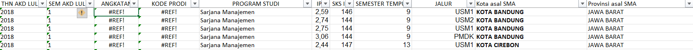
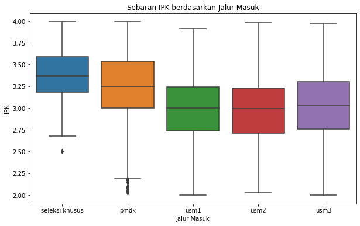
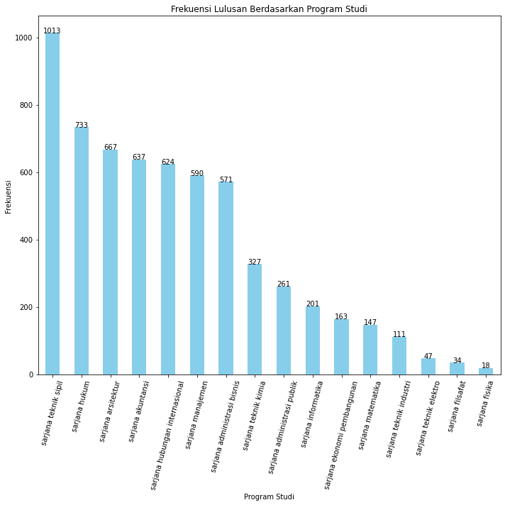
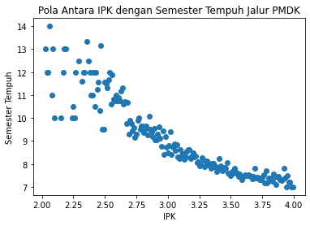
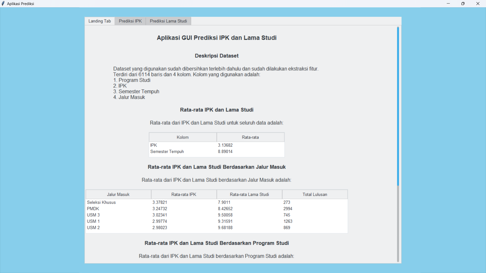
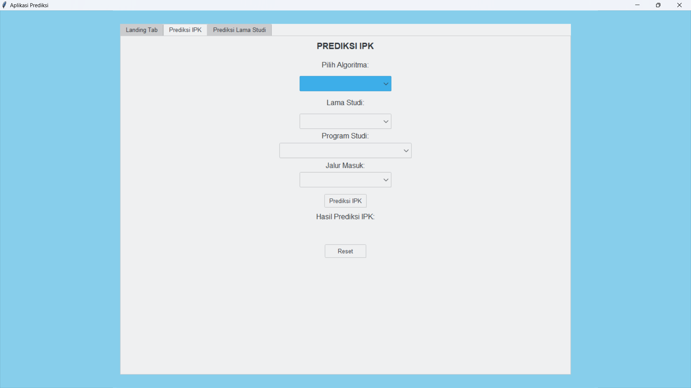
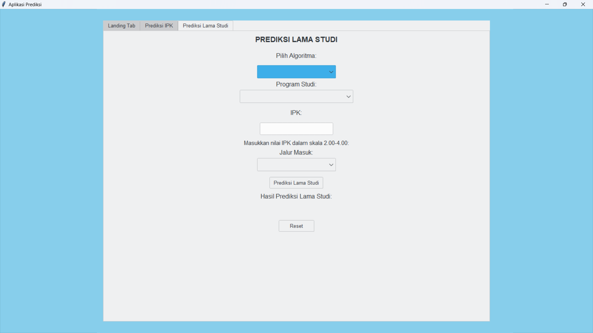
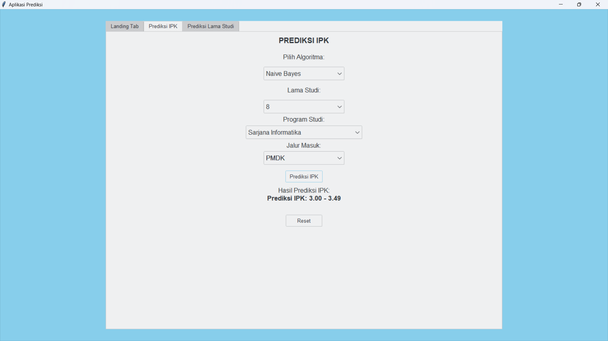
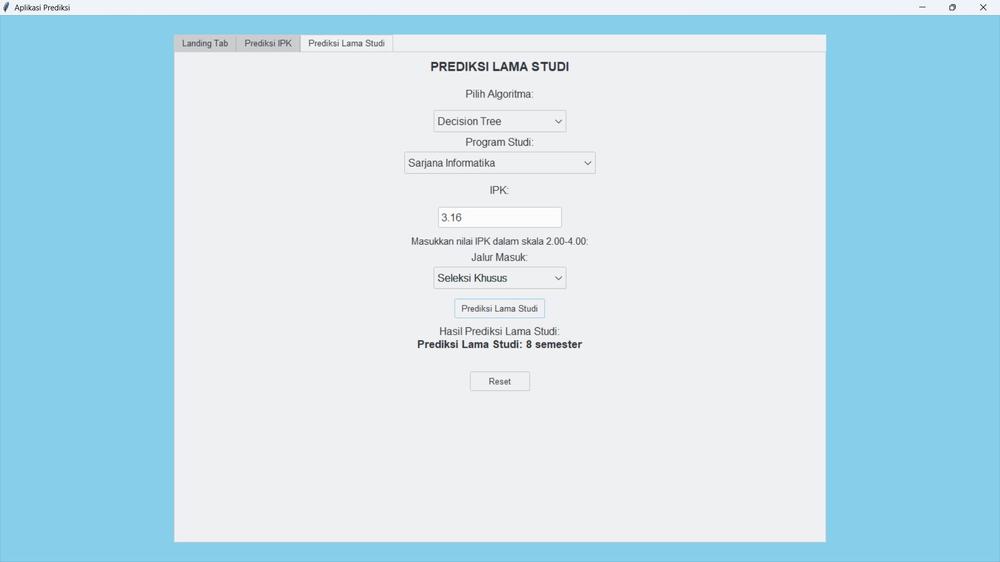

# Data analysis using UNPAR graduates data
- This is my final project for my undergraduate thesis defense.
- The goal is to determine the relationship between GPA, lenght of study, and admission path at Parahyangan Catholic University.

## Analysis Brief
- For the analysis, I'm using two types of analysis, which are descriptive and predictive.
- Descriptive analysis:
  - Statisctical method such as Pearson Correlation, Chi-Square, and data visualization.
  - Clustering such as Agglomerative and K-Means.
- Predictive analysis to build the models:
  - Decision Tree.
  - Naive Bayes.
- The features for the models is selected by using Chi-Square correlation method.
- The models were deployed into a GUI

## Data
- The data I'm using is .xlsx type and it contains information about UNPAR alumni from all departments.
- The data contains 10705 rows and 11 columns
- The example of the data

## Data Cleaning
- There are empty data in several rows and columns. Therefore, I dropped the empty data.
- Columns that are not necessary for the analysis are dropped, such as KODE PRODI and ANGKATAN.
- **The remaning data contains 6144 rows and 6 columns**

## Analysis Results
- **_The analysis proof that there is a relationship between GPA or length of study, and admission path_**
- **_The higher the GPA, the shorter length of study. And vice versa_**
- **_Early admission path results higher GPA and shorter length of study_**
### Data Visualization Analysis
- Some results of the visualization analysis:
  - Boxplot to analyze the distribution of GPA for each admission path
  
  - Bar plot to analyze total students of each major
  
  - Scatter plot to analyze relationship between GPA and length of study for PMDK admission path
  

## GUI
- There are 3 page for the GUI
  - First page
    
  - Second page
    
  - Third page
    
 ## Models prediction example
 - Prediction for GPA
   
 - Prediction for length of study
   
  

